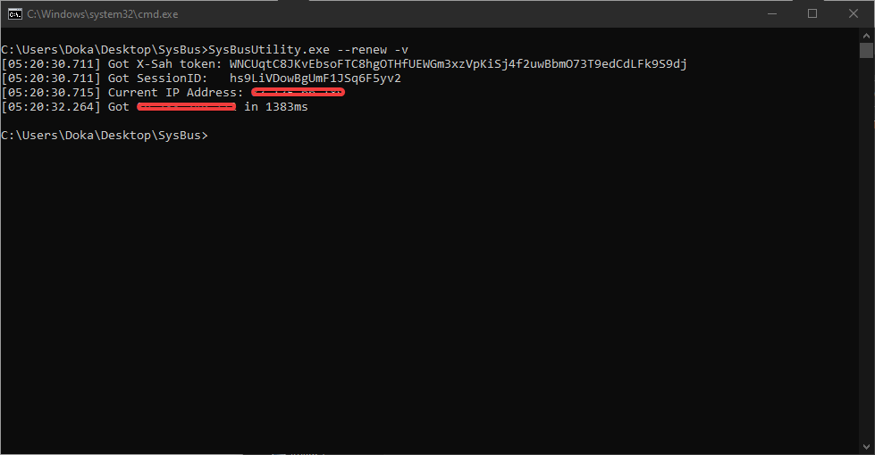

# LiveBox-SysBusUtility

Straightforward very simple API to check and control you'r LiveBox 4.

The utility is not user friendly, it will require you to change credentials, and the livebox ip address.. in order to work. But it's very easy.

It actually don't do much, but it's a solid base.
* --renew : renew public IP

* -v      : display login information

* --status : display LiveBox status

